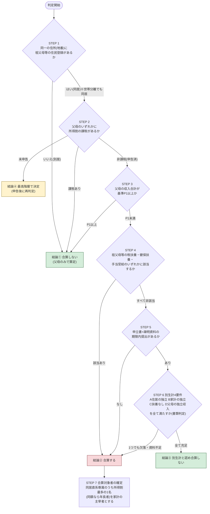

# 同居祖父母等の所得割合算・別生計 判断フローチャート

保育料(利用者負担額)算定時に、児童と同居する祖父母等(父母以外の親族)の
市町村民税所得割を**合算するか/別生計として合算しないか**を、
**誰が判定しても同じ結果になる**よう設計した決定的(deterministic)判定手順。

設計原則:

- 判定はすべて**公簿(住民基本台帳・税情報)と提出書類**のみで行い、判定者の主観・裁量事項を含まない
- 各ステップは**Yes/Noの二択**で、判定順序は固定(前のステップで結論が出たら以降は判定しない)
- 実態確認(STEP 6)は**4要件のAND判定**(全て満たす→別生計、1つでも欠ける→合算)
- 同点・不明時の扱い(タイブレーク)をあらかじめ規定

根拠: `自治体運用比較表.md`(関東34自治体で確認した共通構造)

---

## 1. 事前設定(自治体パラメータ)

判定開始前に、当該自治体の規定から次の1点だけを確定させる。
これにより自治体間の運用差はパラメータに閉じ込められ、フロー自体は共通になる。

| パラメータ | 内容 | 例(比較表より) |
|---|---|---|
| **P1: 父母低所得基準** | 父母が「生計中心者と認められない」とされる収入・課税の基準 | 非課税(さいたま・草加・春日部・藤沢・小山・大田)/年収103万円未満(取手・つくばみらい・土浦・上尾・墨田)/年収120万円以下(横須賀)/非課税+年収180万円以下(船橋・柏)/生活保護基準未満(日立・町田・横浜)/所得32万円以下(宇都宮) |

規定が確認できない自治体では、**もっとも無難な「非課税かつ年収103万円未満」**をP1に用いる
(34自治体中もっとも多い型AとBの重なる範囲であり、これを満たさなければどの型でも合算対象にならない)。

---

## 2. フローチャート

図版: `判断フローチャート.png`(同内容)

---

## 3. 判定手順書(ステップ別の判定基準)

### STEP 1: 同居の確認

| 判定材料 | 基準 |
|---|---|
| 住民基本台帳 | 児童・父母の住所と同一の住所(住居表示・地番)に父母以外の直系尊属等の住民登録があれば「同居」 |

- **世帯分離の有無は考慮しない**(同一地番なら同居。上尾市FAQ・小山市の明文運用に一致)
- 完全分離型二世帯住宅で住居表示・地番が分かれている場合のみ「別居」
- 別居なら以降の判定は不要 → **結論①: 合算しない**

### STEP 2: 父母の課税確認(公簿)

| 判定材料 | 基準 |
|---|---|
| 市町村民税課税情報(算定対象年度) | 父・母のいずれかに所得割の課税があれば → **結論①: 合算しない** |
| 未申告の場合 | 期限までに申告・課税資料の提出がなければ → **結論④: 最高階層で決定**(申告後に再判定) |

### STEP 3: 父母の収入確認

| 判定材料 | 基準 |
|---|---|
| 源泉徴収票・給与明細・確定申告控え等 | 父母の収入合計(公的手当・養育費を含む)が **P1以上** → **結論①: 合算しない** |
| 同上 | **P1未満** → STEP 4へ(合算候補) |

- 収入に含める範囲: 給与・事業収入のほか公的手当・養育費(町田市の運用に準拠。除外すると判定者間で差が出るため必ず含める)

### STEP 4: 扶養関係の確認(公簿・証書)— 該当すれば申立てを待たず合算

| # | 確認事項 | 判定材料 |
|---|---|---|
| ① | 父母又は児童が同居祖父母等の税法上の扶養親族 | 税情報(扶養控除の申告状況) |
| ② | 父母又は児童が同居祖父母等の健康保険の被扶養者 | 健康保険証(資格確認書)の写し |
| ③ | 同居祖父母等が父母・児童を対象とする手当・給付を受給 | 公簿 |

- **1つでも該当 → 結論②: 合算する(別生計申立ては受理しない)**
- 客観的に生計同一を自認している状態であり、実態判断の余地なく合算(練馬区・ひたちなか市・つくば市の扶養要件型と整合)

### STEP 5: 申立ての有無

- 期限内に「生計状況申立書」+疎明資料一式の提出が**なければ → 結論②: 合算する**
- 提出があれば STEP 6 へ

### STEP 6: 別生計4要件のチェックリスト(AND判定)

各要件は「認める資料」のいずれかが提出されている場合に限り**充足**とする。
口頭説明・資料のない申立てのみでは充足としない。

| 要件 | 充足の基準(いずれか) | 認める資料 |
|---|---|---|
| **A 住居の独立** | (a) 完全分離型二世帯住宅(玄関・台所・浴室すべて別) または (b) 電気・ガス・水道の**全メーター・契約が父母名義で別** | 建物図面・登記事項証明書/父母名義の公共料金検針票・領収書 |
| **B 家計の独立** | 家賃(住宅ローン)・光熱水費・食費を父母が自ら負担し、祖父母等との生活費の授受がない | 父母名義の賃貸借契約書・ローン返済予定表/父母名義の領収書・引落し口座の通帳写し |
| **C 扶養関係なし** | STEP 4 の①〜③がすべて非該当(確認済み) | (STEP 4 の資料) |
| **D 父母の独立収入** | 父母のいずれかに就労等による恒常的収入がある(額は問わない。P1未満でも可) | 源泉徴収票・給与明細・開業届+帳簿等 |

判定ルール:

- **A〜D 全て充足 → 結論③: 別生計と認め、合算しない**
- **1つでも欠落(資料不足を含む)→ 結論②: 合算する**
- 資料の追完は自治体の定める期限まで認め、期限経過後は「欠落」として扱う

### STEP 7: 合算する場合の対象者確定(結論②の後処理)

1. 同居の直系尊属等のうち、算定対象年度の**市町村民税所得割額が最多の1名**を「家計の主宰者」とする
2. 所得割額が同額の場合は**年長者**とする(タイブレーク)
3. 父母+当該1名の所得割額を合算(自治体の規定が「祖父母の税額で算定(置き換え)」型の場合はその規定に従う)

---

## 4. この設計が「誰が判定しても同じ」になる理由

| 恣意性の入りやすい論点 | 本フローでの排除方法 |
|---|---|
| 「同居」かどうか | 住民票の世帯ではなく**住所(地番)の同一性**のみで判定(STEP 1) |
| 「生計中心者」かどうか | 判定者の印象ではなく**課税の有無(公簿)+収入基準P1(書類)**の2段判定(STEP 2-3) |
| 「実態として同一生計」かどうか | 自由心証ではなく**資料に紐づく4要件のAND判定**(STEP 6)。要件ごとに認める資料を限定列挙 |
| 誰の税額を合算するか | **最多所得割1名+同額なら年長者**のタイブレークで一意に確定(STEP 7) |
| 書類が出ない場合 | 「未申告→最高階層」「疎明なし→合算」と**デフォルト(推定)を固定**(STEP 2b, 5, 6) |

## 5. 留意事項

- 本フローは関東34自治体で確認した共通構造(比較表§3)を最大公約数として設計したもの。個別自治体で明文の規定(P1の値、置き換え/合算の別、独自要件)がある場合はそちらが優先する
- 数値基準・様式は改定され得るため、運用開始前に原典を確認すること
- STEP 6 の4要件は、日本年金機構「生計同一関係に関する申立書」の判断要素(住居・家計・経済的援助)とも整合しており、他制度との説明の一貫性が保てる
